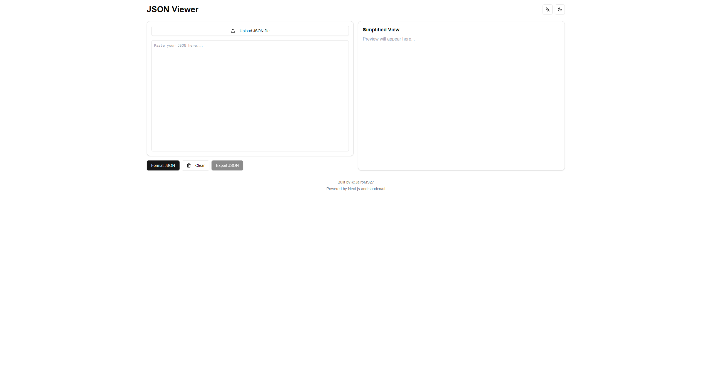

# JSON Viewer

A modern and beautiful JSON viewer and formatter built with Next.js and Tailwind CSS. View, edit, and format JSON with syntax highlighting and a simplified view.



## Features

- 🎨 **Beautiful Syntax Highlighting**: Color-coded JSON for better readability
- 👀 **Simplified View**: A clean, easy-to-read view of your JSON data
- 🌓 **Dark/Light Mode**: Switch between themes for comfortable viewing
- 🌍 **Multi-language Support**: Available in:
  - English
  - Spanish
  - French
  - German
  - Portuguese
- 📝 **JSON Formatting**: Automatically format and validate your JSON
- 📤 **Export**: Save your formatted JSON to a file
- 📁 **File Upload**: Drag & drop or select JSON files to load
- 🧹 **Clear Function**: Easily clear the editor content

## Technologies Used

- [Next.js 14](https://nextjs.org/)
- [Tailwind CSS](https://tailwindcss.com/)
- [Shadcn/ui](https://ui.shadcn.com/)
- [TypeScript](https://www.typescriptlang.org/)

## Getting Started

### Prerequisites

- Node.js 18+ 
- npm or yarn

### Installation

1. Clone the repository:
```bash
git clone https://github.com/JairoMS27/json-viewer.git
cd json-viewer
```

2. Install dependencies:
```bash
npm install
# or
yarn install
```

3. Run the development server:
```bash
npm run dev
# or
yarn dev
```

4. Open [http://localhost:3000](http://localhost:3000) with your browser to see the result.

## Usage

1. **Input JSON**: 
   - Paste your JSON directly into the editor
   - Click the upload button to select a JSON file
   - Drag & drop a JSON file directly into the editor

2. **Format**: Click the "Format JSON" button to automatically format your JSON
3. **View**: See the formatted JSON with syntax highlighting on the left and a simplified view on the right
4. **Export**: Click "Export JSON" to save your formatted JSON to a file
5. **Theme**: Toggle between light and dark mode using the theme switcher
6. **Language**: Select your preferred language from the language dropdown

## 🌐 Netlify Deployment

This project is optimized for Netlify deployment with performance best practices.

1. **Project Preparation**
   - Ensure your project is in a Git repository (GitHub, GitLab, etc.)
   - Project is configured for static builds with `output: 'standalone'`

2. **Netlify Setup**
   - Connect your repository to Netlify
   - Build settings will be automatically configured via `netlify.toml`
   - Default configuration includes:
     - Build command: `npm run build`
     - Publish directory: `.next`
     - Optimized caching
     - Asset compression
     - Security headers

## 📜 Available Scripts

- `npm run dev` - Start development server
- `npm run build` - Build for production
- `npm run start` - Start production server
- `npm run lint` - Run linter

## ⚡ Performance Optimizations

- Aggressive caching strategies
- Automatic image optimization
- JS and CSS minification
- Static asset compression
- Security headers
- SEO optimizations

## 🔒 Security Features

- XSS protection
- Content Security Policy
- Strict MIME type checking
- Frame protection
- Referrer Policy

## Author

- [@JairoMS27](https://github.com/JairoMS27)

## Acknowledgments

- Built with [Next.js](https://nextjs.org/)
- UI components from [Shadcn/ui](https://ui.shadcn.com/)
- Icons from [Lucide](https://lucide.dev/)

## 📄 License

This project is licensed under the [MIT License](LICENSE).

